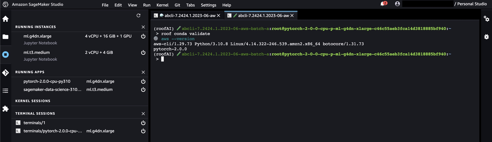

# SageMaker set-up

To use on [AWS SageMaker](https://aws.amazon.com/sagemaker/), change the environment to a `PyTorch 2` image, `Python3` kernel, `ml.g4dn.xlarge` and replace `<plugin-name>` with the name of the plugin in the following instructions.

Open the "system terminal" and paste the sagemaker-system seed 🌱,

```bash
@seed sagemaker-system
```

Open as many image terminals as you wish and paste the sagemaker seed 🌱

```bash
@seed sagemaker plugin=<plugin-name>
```



---

supports: [🌈 Vancouver-Watching](https://github.com/kamangir/Vancouver-Watching), [🏛️ roofAI](https://github.com/kamangir/roofAI), [🌀 blue plugin]()s `> 2.88.1`.
